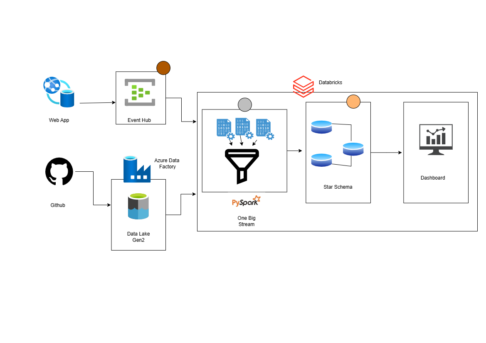

# Uber Ride Analytics Platform

An end-to-end data engineering and analytics project built to simulate a ride-hailing platform. This project collects ride-related data from multiple sources, processes it using Azure and Databricks, stores it in an analytical star schema, and presents insights through an interactive dashboard.

## Project Overview

This project was designed to demonstrate a complete modern data pipeline for ride analytics. It combines batch ingestion, streaming ingestion, cloud storage, distributed processing, dimensional modeling, and dashboard visualization.

The platform includes:

- A web application that simulates ride booking activity
- Streaming ingestion through Azure Event Hub
- Batch ingestion from GitHub into Azure Data Lake Gen2 using Azure Data Factory
- Data transformation using PySpark in Databricks
- Analytical modeling using a star schema
- Dashboarding for business insights and reporting

## Architecture

The solution is built using the following flow:

1. The **Web App** generates ride-related data.
2. Streaming data is sent to **Azure Event Hub**.
3. Static or batch data is pulled from **GitHub** into **Azure Data Lake Storage Gen2** through **Azure Data Factory**.
4. Both streaming and batch data are processed in **Databricks** using **PySpark**.
5. The transformed data is modeled into a **Star Schema** for analytics.
6. The final curated data is used to power an interactive **dashboard**.

## Architecture Diagram

## Web Application Preview

The web application simulates the ride-booking experience and acts as one of the data sources for the project.

## Dashboard Preview

The dashboard provides analytics such as passenger distribution, vehicle fare analysis, payment trends, and pickup city insights.

## Tech Stack
Cloud and Data Engineering
Azure Event Hub – streaming data ingestion
Azure Data Factory – batch pipeline orchestration
Azure Data Lake Storage Gen2 – data lake storage
Azure Databricks – data processing and analytics
PySpark – transformation and ETL logic

## Data Modeling
Star Schema
Fact table for rides
Dimension tables for vehicle, passenger, payment, location, time, and related entities

Frontend / Simulation
Web Application for ride booking simulation
Visualization
Databricks Dashboard for business intelligence and analytics

Features
End-to-end batch and streaming data pipeline
Cloud-based data ingestion and storage
Distributed data processing with PySpark
Analytical data modeling using star schema design
Interactive dashboard for ride analytics
Practical simulation of a real-world ride-hailing data platform

## Data Pipeline Components
1. Streaming Layer

Ride events generated by the web application are sent to Azure Event Hub. This simulates real-time ride activity such as bookings and trip updates.

2. Batch Ingestion Layer

Reference or external source data stored in GitHub is ingested into Azure Data Lake Gen2 using Azure Data Factory.

3. Processing Layer

Databricks processes both streaming and batch data using PySpark. Data cleansing, transformation, enrichment, and integration are performed here.

4. Modeling Layer

Processed data is transformed into a star schema for efficient querying and reporting.

5. Analytics Layer

The dashboard visualizes key metrics and trends from the curated analytical dataset.

Example Analytics

The dashboard can be used to analyze:

Passenger count by pickup city
Total fare by vehicle
Fare component breakdown
Payment method distribution
Distance and trip activity trends
Operational ride patterns

Learning Outcomes

This project helped strengthen practical knowledge in:

building cloud-based data pipelines
working with batch and streaming data
designing dimensional data models
using Databricks and PySpark for ETL
creating business dashboards from curated datasets
integrating multiple Azure services into one workflow
Future Improvements

Possible enhancements for this project include:

real-time dashboard refresh
automated pipeline scheduling
data quality validation layer
CI/CD deployment for pipelines
advanced analytics and forecasting
role-based dashboard access
Delta Lake integration for improved reliability
